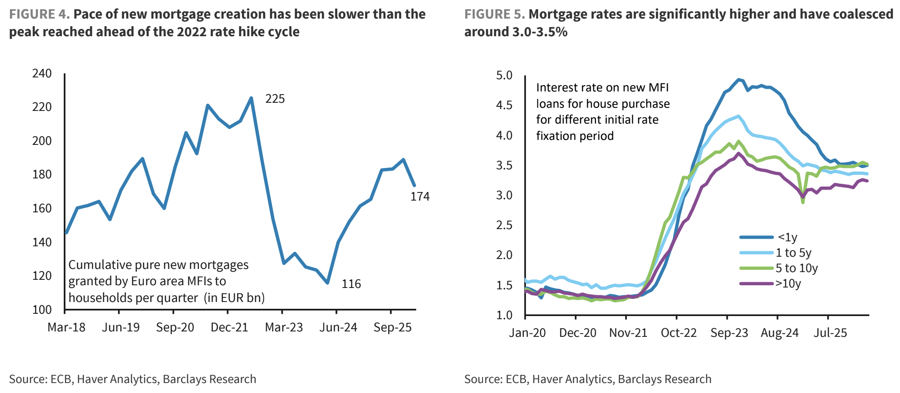
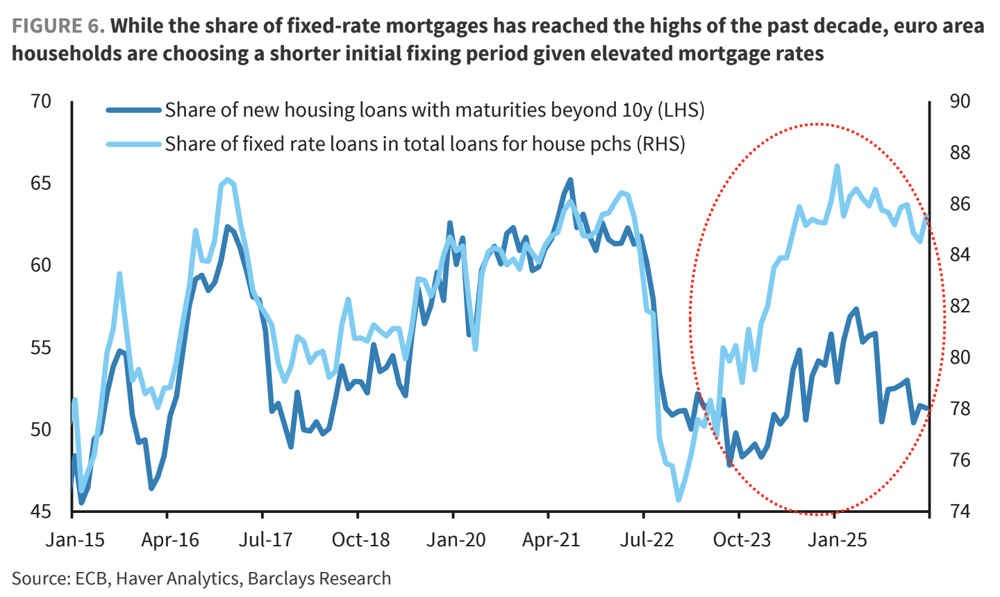
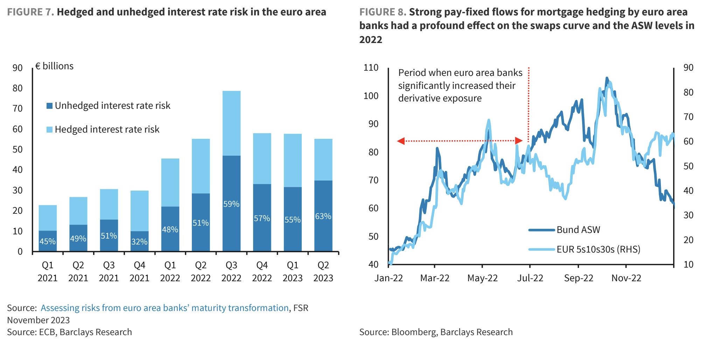
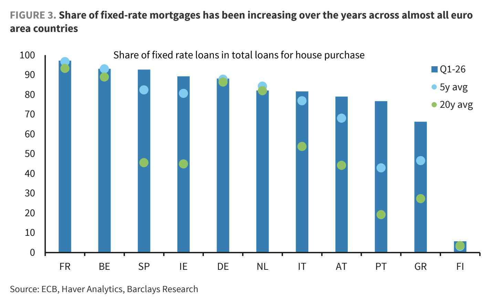

# EUR 5s10s30s: Mortgage Convexity Hedging Redux?

The EUR 5s10s30s became historically dislocated in 2022, with the 10s cheapening in an outsize manner on the curve (see figure, below). A key driver of this cheapening were paying flows in the EUR belly, themselves a result of mortgage convexity hedging on the part of European banks.

Banks are in the business of maturity transformation; they borrow short, and lend long. In other words, their 'duration gap' is positive; the duration of their assets is longer than that of their liabilities. 
This means that as interest rates rise, the value of their assets falls more than that of their liabilities - thereby reducing the bank's economic-value-of-equity. Now, a considerable portion of European Banks' assets comprises mortgages. And unlike bonds, the duration of a mortgages increases with interest rates, as the likelihood of borrowers re-financing decreases (given that rates are rising). 

It stands to reason, then, that as interest rates rise, a bank's duration gap increases - the duration of its assets rises relative to that of its liabilities. This is conventionally addressed by adding a negative-duration position to its asset book, thereby lowering the duration of its assets relative to that of its liabilities. This asset is precisely a paid position in an interest rate swap, sized with appropriate DVO1.

So: rates begin to increase --> (duration of assets - duration of liabilities) increases --> banks scramble to pay fixed in belly IRSs. But in fact one step is missing. The conclusion only follows if: banks' outstanding mortgage books (i) comprise a sufficiently large proportion of _fixed_-rate mortgages; and (ii) that pool of fixed rate mortgages is of a sufficiently long weighted-average duration. Absent (i) duration worries are moot; absent (ii), whatever duration increases do occur, will be ~small ~, and hence unlikely to trigger a wave of paying. 

The question then stands: with the ECB leaning hawkish in its response to the Middle East conflict, can we expect another wave of mortgage convexity hedging (and thus paying in the belly), as witnessed in 2022? Well, we need just check for whether (i) and (ii) obtain across banks' outstanding mortgage books. Though not quite just that. Though true (i) and (ii) may be, we need also know banks' outstanding duration gap. Maybe it is low - perhaps because they have been actively hedging their duration exposure (maybe they were anticipating the increase, maybe 2022 spurred a paranoia which simply dictated a smaller steady-state duration gap at all times, etc.) - in which case we should expect no major paying wave. So in reality one must know:

(1) Fixed-rate mortgages as prop. Of outstanding mortgage books;
(2) Weighted-average duration of universe in (i);
(3) Extant duration gap across universe of European banks - and hence the degree to which increase in rates would induce tsunami of paying hedging.

It is only after furnishing answers to these questions which one may propose doing some paying of their own - in the belly of the EUR 5s10s30s.

Some data/charts from Barclays:

### Ali Lodhi
