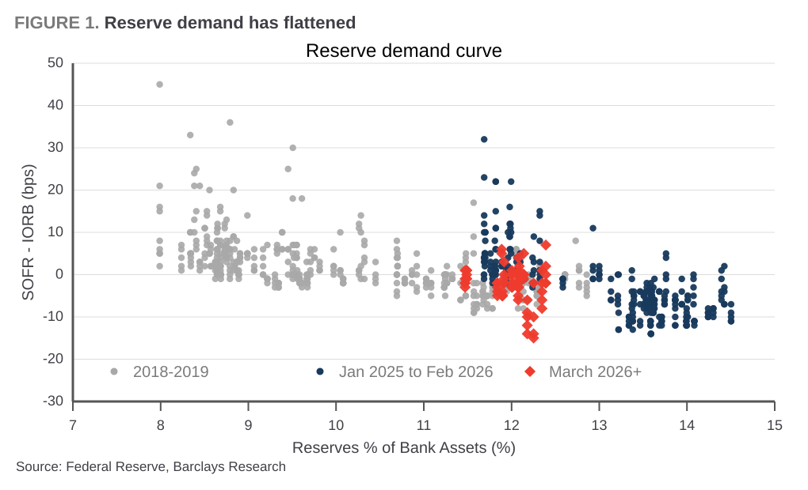
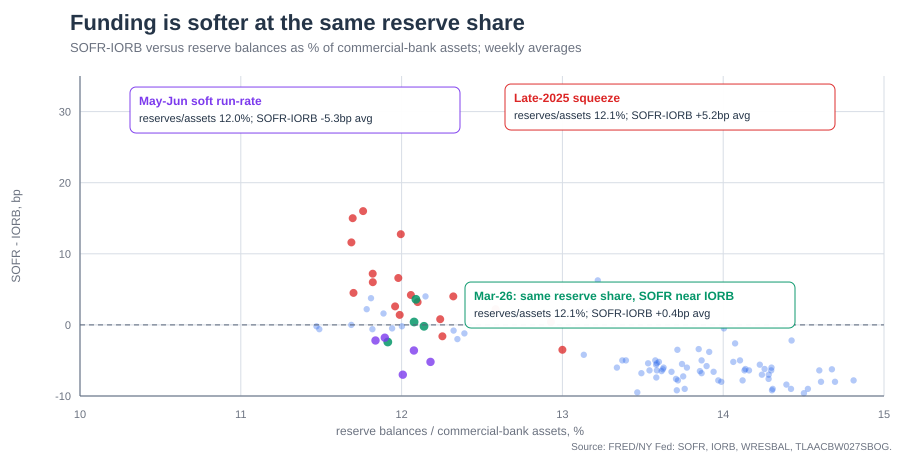
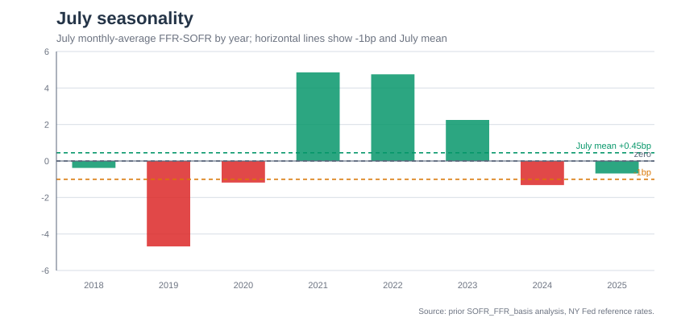

# Long July SOFR/FFR Basis

The trade is to go **long July FFR-SOFR** at **-1bp**, targeting **+2bp**. The fixing is the calendar-month average of **EFFR minus SOFR**; negative means SOFR is rich to Fed Funds, i.e. secured funding is tight. The thesis has two parts: the market is pricing a hawkish/tight funding outcome, while the actual funding backdrop looks soft.

First, -1bp is cheap in the relevant distribution. Since SOFR inception, -1bp is the 30th percentile of monthly-average FFR-SOFR; even among quarter-end months it is only the 33rd percentile. July is not a quarter-end month, so the clean analogue is actually non-quarter-end months, where -1bp is the 29th percentile. In other words, the market is pricing July like a below-normal funding month despite the absence of the main calendar stress.

| Monthly-average sample | Median | -1bp percentile | Share above -1bp |
| --- | ---: | ---: | ---: |
| All months | +0.47bp | 30th | 70% |
| Quarter-end months | +0.47bp | 33rd | 67% |
| Non-quarter-end months | +0.68bp | 29th | 71% |
| July months | -0.53bp | 38th | 63% |

Second, conditions do not look tight. Recent realized funding has already normalized: May printed +4.25bp, June +0.22bp, and the last-three-month average is +1.43bp. The basis is persistent: last-month to next-month beta is 0.61, while prior-three-month average to next-month beta is 0.72, putting simple July forecasts at +0.3bp to +1.2bp.

The strongest fundamental evidence is the reserve-demand curve. Late last year, when reserves were in the same reserve-share zone, SOFR traded materially over IORB. By March 2026, a similar reserve share left SOFR roughly in line with IORB. Same scarcity, softer price: funding has structurally loosened.

This is not a mystery. The [Fed's November 2025 eSLR final rule](https://www.federalreserve.gov/newsevents/pressreleases/bcreg20251125b.htm) explicitly aimed to reduce disincentives to low-risk activity such as Treasury intermediation and make leverage standards a backstop to risk-based capital requirements. Put simply, the risk-based ratio is the smart but model-dependent constraint; the leverage ratio is the dumb, hard backstop on total size. The reform made that backstop less binding.

Using Q1 2026 FR Y-15 filings, Barclays estimates excess GSIB leverage capacity as:

`excess capacity = (risk-based-minimum Tier 1 capital / new eSLR minimum) - current TLE`

TLE is Total Leverage Exposure, the leverage-ratio denominator. Even if banks return excess capital and hold only the risk-based minimum, the estimate still leaves roughly **$4tn** of spare leverage capacity before leverage binds. That is the intermediation firepower that keeps repo smooth.

The risk is that July bill supply and the TGA rebuild drain reserves faster than expected. Barclays' rebuttal is that the rebuild is late-month and methodical, average July reserves should remain around $3.0-3.1tn, SOFR has low bill-supply sensitivity, and dealer capacity is now abundant. Thus -1bp prices the fear; the fundamentals argue for fair value closer to +2bp.

### Ali Lodhi
