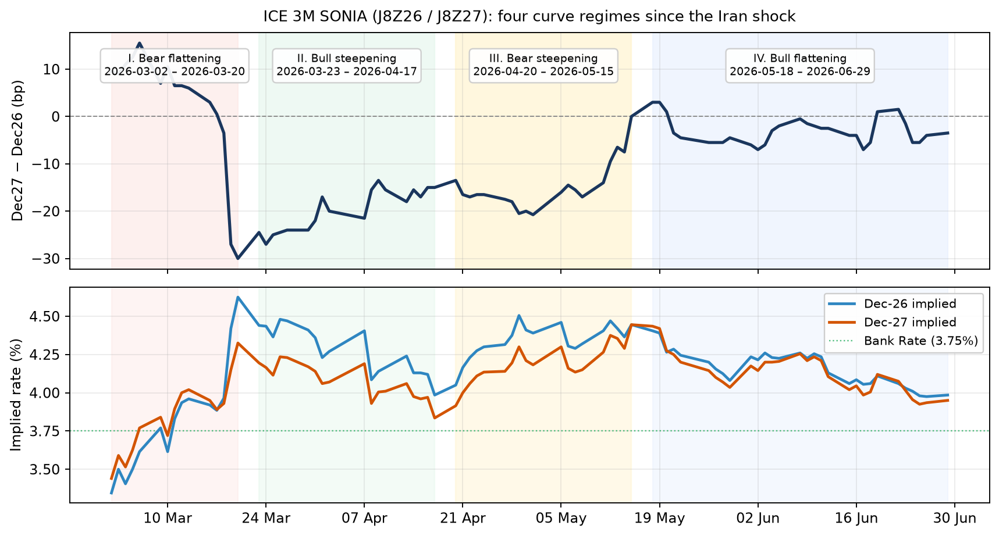

# Dec27−Dec26 on ICE 3M SONIA: four curve regimes since onset of Iran conflict

Post onset of the Iran conflict, the Dec-27 - Dec-26 ran through four seperablre regimes. In each, Dec 26 either rallied, or sold-off. Concurrently, the curve either flattened/steepened bullishly, or flattened/steepened bearishly. The question in each regime was: should one have traded _via_ a Dec-26 outright, or instead _via_ a curve expression? Specifically we ask: in each phase which trade had the better ratio of total return to abs(max DD). 

For example: if a particular phase saw Dec 26 outright rally, and the curve bull steepen, did the days on which Dec 26 sold-off the most see the curve bear steepen? If so, did such steepening cushion the PnL of a steepener position enough, such that the steepener's ratio of total return/abs(max DD) beat that of an outright Dec 26? The question is this: was a steepener a more sophisticated way of being long duration, because it paid along the realised path (that is, bull steepening occurred), but, along the way, it also paid in the event of bearish shocks (i.e., because bearish shocks saw steepening, too - just a different kind)? 

We like sophisticated ways if exoressing an outright view on duration. if a curve expression pays both on the realisation of my duration view, and on shocks to the contrary, it is a more asymmetric way of simply being long/short duration outright. If I have a long duration view, and the curve bull steepens over the sample, yet bear steepens upon hawkish shocks - why not put on a steepener instead? Unfortunately, sometimes the curve behaviour associated with my modal duration view is contrary to that associated with the converse of my modal duration view (i.e., the modal path is steepening, yet hawkish shocks induce bear flattening). 
---

## Method

We use ICE 3M SONIA futures J8Z26 (Dec-26) and J8Z27 (Dec-27). The spread is Dec27 minus Dec26 in basis points. The sample runs from 2 March 2026, the first post-weekend session after the shock, through 29 June.

Phases are defined as follows:

---

## Four phases

| Phase | Window | Level | Curve | Question |
|-------|--------|-------|-------|----------|
| **I** | 2 Mar – 20 Mar | Bear | Bear flattening | Short Dec-26 vs flattener |
| **II** | 23 Mar – 17 Apr | Bull | Bull steepening | Long Dec-26 vs steepener |
| **III** | 20 Apr – 15 May | Bear | Bear steepening | Short Dec-26 vs steepener |
| **IV** | 18 May – 29 Jun | Bull | Bull flattening | Long Dec-26 vs flattener |

*Top: Dec27−Dec26 spread (bp). Bottom: Dec-26 and Dec-27 implied rates (%); green dotted = Bank Rate 3.75%.*

---

## Phase I — Bear level, bear flattening

Over fourteen sessions both legs sold off violently and the front ran harder. Dec-26 rose 128 bp, Dec-27 rose 89 bp, and the spread collapsed from +9.5 bp to −30 bp — a deep inversion. The level move was bear; the curve move was bear flattening.

The outright expression is short Dec-26. The curve expression is a flattener. Short Dec-26 returned +128 bp over the phase with a maximum drawdown of −15.5 bp, giving a return-to-max-drawdown ratio of 8.3. The flattener returned +39.5 bp with max drawdown −6.5 bp and a ratio of 6.1. The outright max drawdown was 2.4 times larger.

Four of fourteen days (29%) were contrary to the net change — the front end fell, hurting the short. On half of those the curve still flattened. The other half bull-steepened. These four days were:

| Date | Outright | Flattener | ΔDec26 | Curve type |
|------|----------|-----------|--------|------------|
| 10 Mar | −15.5 | −3.5 | −15.5 | Bull steepening |
| 4 Mar | −9.5 | −2.0 | −9.5 | Bull steepening |
| 16 Mar | −4.0 | +3.0 | −4.0 | Bull flattening |
| 17 Mar | −3.5 | +2.5 | −3.5 | Bull flattening |

The two largest hits — 4 and 10 March, together −25 bp on the short — were bull-steepening days. Wrong curve for a flattener; the spread still lost only −5.5 bp combined, cutting the outright damage by roughly three quarters. The two smaller losses came on bull-flattening days: outright −7.5 bp, flattener +5.5 bp. When the curve moved correctly on a bad outright day, it flipped positive.

**Outright wins on total return / abs(max DD) in this phase**. 

---

## Phase II — Bull level, bull steepening

Over eighteen sessions both legs rallied. Dec-26 fell 45.5 bp, Dec-27 fell 36 bp, and the spread recovered from −24.5 bp to −15 bp. Bull level, bull steepening curve.

Long Dec-26 returned +64 bp; max drawdown −17.5 bp; ratio 3.7. The steepener returned +15 bp; max drawdown −4.5 bp; ratio 3.3. The outright drawdown was 3.9 times larger — the widest gap in the sample — yet total return / abs(max DD) is nearly identical.

Six of eighteen days (33%) were contrary: Dec-26 rose, hurting the long. Only two of those six steepened. Most contrary days bear-flattened.

The five worst outright sessions:

| Date | Outright | Steepener | ΔDec26 | Curve type |
|------|----------|-----------|--------|------------|
| 7 Apr | −13.5 | −1.5 | +13.5 | Bear flattening |
| 26 Mar | −11.5 | +0.5 | +11.5 | Bear steepening |
| 13 Apr | −7.5 | −2.5 | +7.5 | Bear flattening |
| 9 Apr | −5.5 | +2.0 | +5.5 | Bear steepening |
| 4 Apr | −4.0 | −3.0 | +4.0 | Bear flattening |

Two of the five worst days steepened — 26 March and 9 April. On those two the outright lost −17 bp while the steepener earned +2.5 bp. On the three that bear-flattened, outright lost −25 bp and the steepener lost −7 bp. 
**This is the phase where the curve nearly matches outright on total return / abs(max DD) (3.3 vs 3.7) at less than a quarter of the max drawdown**. The insurance is real even though only a third of contrary days steepen.

---

## Phase III — Bear level, bear steepening

Nineteen sessions. Dec-26 rose 39.5 bp, Dec-27 rose 53 bp, spread moved from −13.5 bp to flat. Bear level, bear steepening — the belly repricing hawkishly relative to the front.

Short Dec-26: +46 bp total, −21.5 bp max drawdown, ratio 2.1. Steepener: +15 bp total, −7.3 bp max drawdown, ratio 2.1. **Identical total return / abs(max DD)**, but the outright drawdown was three times deeper.

Six of nineteen days (32%) were contrary. Half steepened.

The five worst outright sessions:

| Date | Outright | Steepener | ΔDec26 | Curve type |
|------|----------|-----------|--------|------------|
| 6 May | −15.5 | +1.5 | −15.5 | Bull steepening |
| 30 Apr | −9.5 | +0.5 | −9.5 | Bull steepening |
| 14 May | −5.5 | −1.0 | −5.5 | Bull flattening |
| 13 May | −5.0 | +3.0 | −5.0 | Bull steepening |
| 1 May | −2.0 | −0.7 | −2.0 | Bull flattening |

Three of the five worst days steepened. On those three the outright lost −30 bp. The steepener earned +5 bp. On the two that flattened, outright lost −7.5 bp and the steepener lost −1.7 bp.

**This is the standout. The curve does not just cushion the worst sessions — on the three largest outright hits it is profitable. Total return / abs(max DD) matches the outright at one-third of the drawdown.** Phase III is where the steepener pays for itself on the days that matter.

---

## Phase IV — Bull level, bull flattening

Thirty sessions. Dec-26 fell 42 bp, Dec-27 fell 49 bp, spread moved from +3.0 bp to −3.5 bp. Bull level, but the belly outperformed on the way down — bull flattening.

Long Dec-26: +46 bp, −18.0 bp max drawdown, ratio 2.6. Flattener: +3.5 bp, −8.5 bp max drawdown, ratio 0.4. Outright dominates on every measure except raw tail size.

Nine of thirty days (30%) were contrary. Only a third flattened.

The five worst outright sessions:

| Date | Outright | Flattener | ΔDec26 | Curve type |
|------|----------|-----------|--------|------------|
| 1 Jun | −15.5 | +1.5 | +15.5 | Bear flattening |
| 19 Jun | −5.0 | −6.5 | +5.0 | Bear steepening |
| 3 Jun | −4.5 | −1.0 | +4.5 | Bear steepening |
| 8 Jun | −3.5 | −1.5 | +3.5 | Bear steepening |
| 10 Jun | −3.0 | +0.5 | +3.0 | Bear flattening |

The single worst day — 1 June, outright −15.5 bp — was a bear-flattening session and the flattener earned +1.5 bp. That is the hedge working perfectly on the tail event. But the next three worst days all bear-steepened; both structures lost, and the flattener lost more on 19 June (−6.5 bp vs −5.0 bp outright).

Two of five worst days had the right curve; three did not. On the two correct days, outright lost −18.5 bp and the flattener earned +2 bp. On the three wrong days, outright lost −13 bp and the flattener lost −9 bp. Tail risk is halved, but return per unit of drawdown collapses to 0.4 against 2.6 for outright. The flattener is not a substitute for being long in this phase.

---

## Synthesis

| Phase | Level + curve | Contrary days | Correct curve on contrary | Return / \|max DD\| outright | Return / \|max DD\| curve | Outright / curve score |
|-------|---------------|---------------|---------------------------|-------------------------------|---------------------------|------------------------|
| **I** | Bear + bear flat | 29% | 50% | **8.3** | 6.1 | 1.4× |
| **II** | Bull + bull steep | 33% | 33% | **3.7** | 3.3 | 1.1× |
| **III** | Bear + bear steep | 32% | 50% | 2.1 | **2.1** | 1.0× |
| **IV** | Bull + bull flat | 30% | 33% | **2.6** | 0.4 | 6.5× |

Every phase is roughly thirty percent contrary days. The proportion of those days on which the curve moves correctly is necessary but not sufficient — what matters is whether the **worst outright sessions** fall on correctly-moving curve days.

When they do, the spread can earn while the outright bleeds (Phase III: −30 bp outright, +5 bp steepener on the three worst steepening days). When they do not, the spread still often softens the blow (Phase I: −25 bp outright, −5.5 bp flattener on the two largest bull-steepening hits) but cannot match total return.

Return per unit of maximum drawdown is the honest scorecard. Outright captures more total return in every phase. The curve is rational only where worst-day curve behaviour and contrary-day alignment combine to hold that ratio up while materially reducing drawdown — Phase II (3.3 vs 3.7 at one-quarter of the tail) and Phase III (2.1 vs 2.1 at one-third). Elsewhere, outright wins.

The belly was four different environments. The right question in each was not "bull or bear" alone, but whether the curve shape on the bad days justified being curved rather than outright.

## Ali Lodhi
