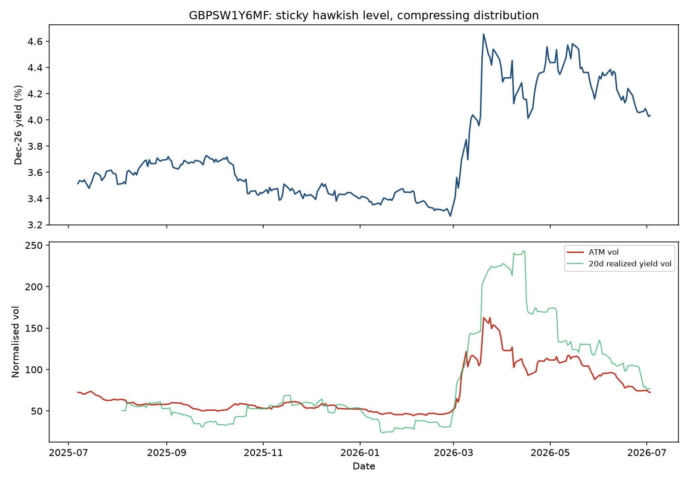
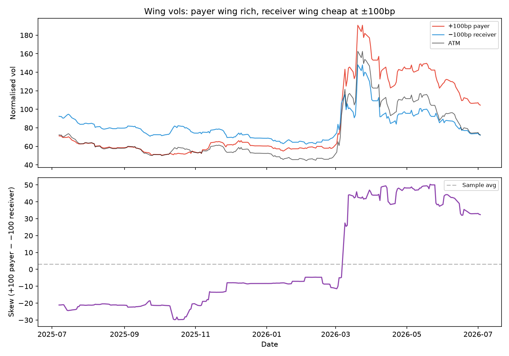
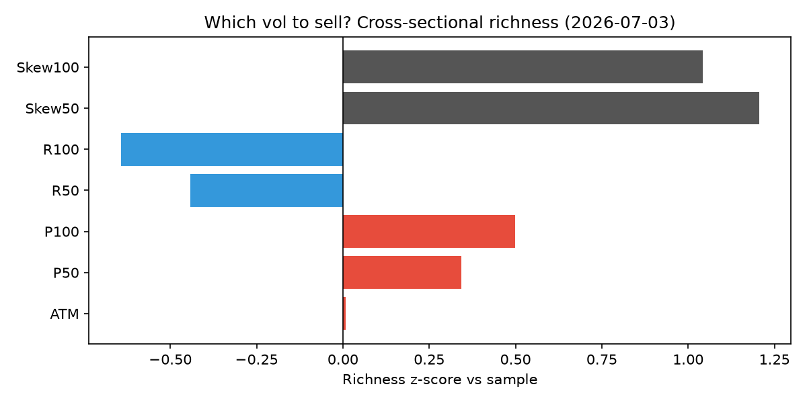

# Dec-26 SONIA vol: don't fight the level — sell payer skew

Dec-26 SONIA pricing looks hawkish. **GBPSW1Y6MF** — the 1Y×6M normalised swaption surface on the Dec-26 forward — prices **4.03%** as of 3 July, **71st percentile** over the past year and **+7%** above the sample average of 3.76%. That is a sticky premium: the level has sat in the top quartile since the Iran shock, and fighting it outright has been painful even as the macro backdrop has softened.

The better expression of a **long-duration** view is through **vol-selling formats**. The distribution of Dec-26 outcomes is **compressing** — realised yield volatility has fallen sharply even though the probability-weighted mean has not moved much lower — while implied vol, especially in the hawkish wing, has been **slow to follow**. The question is which vol to sell: ATM, payer, receiver, or skew? The cross-section of the surface answers it.

---

## Distribution compressing, premium sticky

Two facts sit in tension, and that tension defines the trade.

**First, the level is rich.** Dec-26 yield at 4.03% is at the **71st percentile** of the past year's range. Post-April the forward has averaged **4.29%** versus **3.57%** pre-April. If you are simply short the rate, you are fighting a premium that mean-reverts only slowly.

**Second, the distribution is already narrowing.** Sixty-day annualised yield stdev has fallen from **161bp** to **111bp** — a **31%** compression — while daily moves since mid-May have averaged just **5.6bp** stdev. Twenty-day realised yield vol prints **76.8** (normalised units) against ATM implied of **72.3**: ATM is not wildly overpriced versus recent realised, but it is also **not** at the sticky highs of the shock — the 60-day ATM average is still **97**, **35%** above spot. Vol was sticky on the way up; it is grinding lower now as the distribution tightens.

The thesis: **even if the modal Dec-26 outcome stays near current levels, the standard deviation of outcomes should continue to fall.** That favours vol-selling in general — but not uniformly across the surface.

*Top: Dec-26 forward yield (%). Bottom: ATM normalised vol (red) vs 20-day realised yield vol (green).*

---

## Which vol to sell?

We compare each strike to its own history (260 daily observations, Jul 2025–Jul 2026). Richness is measured as percentile rank and z-score versus the full sample.

| Leg | Level | vs avg | Percentile | Sell? |
|-----|------:|-------:|-----------:|-------|
| ATM | 72.3 | +0.3% | 65th | Neutral — not rich enough alone |
| +50bp payer | 87.5 | +15.4% | 67th | **Rich** |
| +100bp payer | 104.5 | +22.8% | 67th | **Rich** |
| −50bp receiver | 66.1 | −11.8% | 39th | **Cheap — do not sell** |
| −100bp receiver | 72.1 | −12.0% | 25th | **Cheap — do not sell** |
| Payer skew (+50 − −50) | 21.4 | +2,455% vs avg 0.8 | 70th | **Richest** |
| Payer skew (+100 − −100) | 32.4 | vs avg 3.2 | 69th | **Richest** |

Three conclusions follow directly from the data.

**1. Do not sell receiver vol.** The receiver wing is the cheap part of the surface. At −100bp, receiver vol is at the **25th percentile** (z = −0.64). Selling it monetises little premium and gives away the convexity you want for a long-duration view — the very convexity that pays when Dec-26 finally rallies.

**2. Do not rely on outright ATM vol sales alone.** ATM is essentially fair: **+0.3%** versus its long-run average (z = +0.01). You are not being paid for a naked short vol position at the money; the richness is elsewhere.

**3. Sell payer wing vol, not receiver — and not via a payer RR.** The hawkish wing is where the sticky premium lives. +100bp payer vol is **+23%** rich to its own average; −100bp receiver vol is **−12%** cheap. Payer skew is elevated (32.4 at the 69th percentile), but monetising it with a classic payer RR — sell P100, buy R100 — embeds a long low-strike receiver that leaves you **longer vega as vol compresses**. The data favour **selling +100bp payer outright** and expressing long duration separately.

*Top: +100bp payer (red), −100bp receiver (blue), ATM (black). Bottom: payer skew (+100 − −100).*

*Richness z-scores by strike: payer wing and skew are the outliers.*

---

## Recommended structure

### The vega-path problem with a payer RR

The natural skew expression — sell +100bp payer, buy −100bp receiver — monetises the rich hawkish wing. But it embeds a **long low-strike receiver vol** leg. That creates a vega-path problem on the compression thesis.

When implied vol falls, you want to be **net short vega** throughout. A payer RR works against that: the long receiver is long vol on the leg that is already cheap (72.1 vs payer 104.5). On a uniform 10% vol decline, short P100 alone earns **~10.5 vol points**; the equal-notional RR earns only **~3.2** — the receiver leg gives back most of the compression PnL. Worse, as rates rally toward your long-duration view, the receiver moves closer to the money and the structure **gets longer vega** precisely when vol is compressing — the classic re-hedging asymmetry (see [post_10](post_10/body.md)). Historically, when ATM vol fell more than 5 points over 20 days, short P100 returned **+13.1 vol points** on average; the P100/R100 RR returned only **+1.2**.

Buying cheap receiver vol is the right way to get convexity. It is the **wrong** way to sell vol into a compressing distribution.

### What to do instead: separate duration from vol

**Vol leg: sell +100bp payer vol outright** (or a payer-side spread — short P100, long P50 — if you want skew exposure without touching the receiver wing).

- +100bp payer at **104.5** is the richest outright vol leg (+23% vs average, z = +0.50).
- Stays **net short vega** through the compression path: no long receiver to absorb the vol decline.
- When skew has been above the 75th percentile, short P100 has returned **+15.8 vol points** over the next 20 sessions on average, versus **+2.7** for the RR.

**Duration leg: express separately** — long Dec-26 outright, or via the Dec27−Dec26 curve (see [post_15](post_15/body.md)) — rather than embedding it in a long receiver vol purchase. Do not fight the sticky rate level on the vol trade; fight it on the rate trade only if you have a separate view. The vol trade is purely: sell the rich hawkish wing into distribution compression.

If you want skew monetisation **and** net short vega, prefer a **payer-side spread** (short +100bp payer, long +50bp payer): short **17 vol points** of outer payer skew, entirely on the rich side of the surface, with no receiver leg. Historical PnL when vol falls is weaker than naked short P100 (−0.8 vs +13.1 when ATM drops), so the cleaner expression remains **short P100 outright**.

| Expression | Verdict |
|------------|---------|
| Short Dec-26 outright (alone) | **Avoid** — level premium is sticky |
| Sell ATM straddle | **Weak** — ATM is fair, not rich |
| Sell receiver vol | **Avoid** — cheap, adds long vega you don't want |
| **Sell +100bp payer vol outright** | **Best vol expression** — rich, net short vega, captures compression |
| Payer spread (short P100, long P50) | **Acceptable** — skew without receiver, but less PnL than naked P100 |
| Payer RR (short P100, long R100) | **Avoid for vol** — long cheap receiver fights compression; vega path wrong |
| Long Dec-26 + short P100 (combined) | **Best overall** — duration and vol separated, each in the right format |

---

## Ali Lodhi
