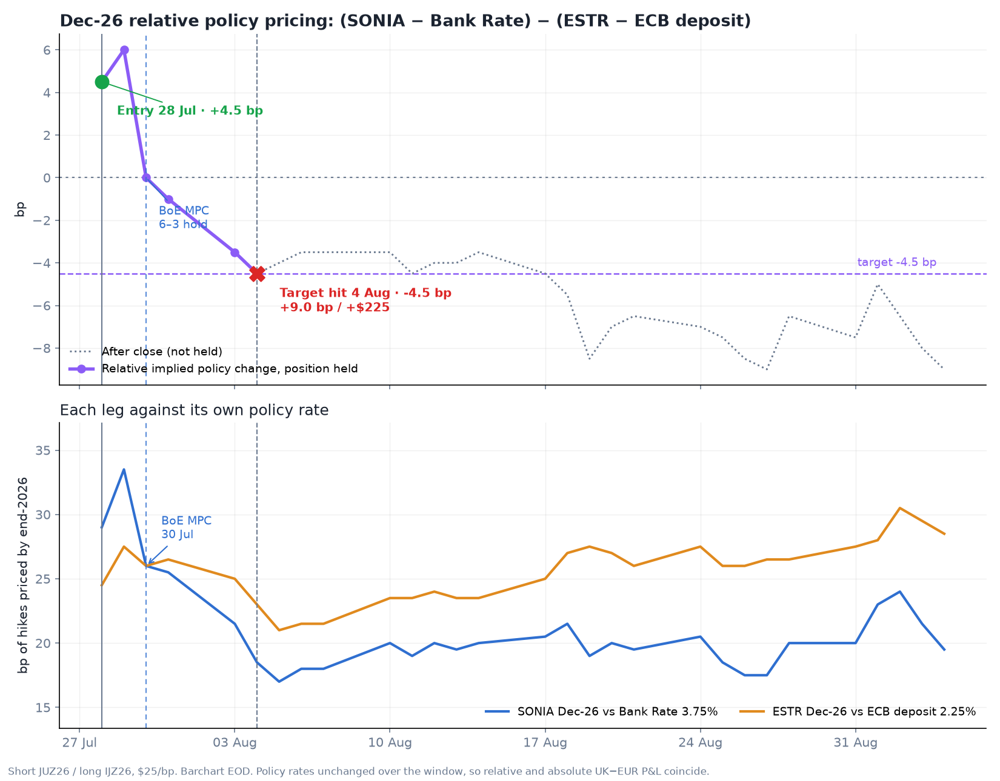

# Trade Update: Closing our BoE−ECB Dec-26 flattener for +9.0bps

On 28 July 2026 we opened the Dec-26 UK−EUR relative-policy flattener described in [post_17](post_17/body.md). We closed at EOD on **4 August 2026** — the first session at which the published **−4.5 bp** relative target printed.

### Trade summary

| | Entry (28 Jul EOD) | Exit (4 Aug EOD) |
| --- | ---: | ---: |
| **Position** | Short JUZ26 (SONIA Dec-26) / Long IJZ26 (ESTR Dec-26) | Take-profit |
| **Relative (UK gap − EUR gap)** | **+4.5 bp** | **−4.5 bp** |
| **UK−EUR absolute (Dec-26 spread)** | 154.5 bp | 145.5 bp |
| **Δ relative** | | **−9.0 bp** |
| **P&L** | | **+$225.00** ($25/bp) |
| **Sessions held** | | 5 |
| **Worst mark** | | **−$37.50** (29 Jul, relative **+6.0 bp**) |
| **Stop** | +8.5 bp relative | Never threatened |

Proceeds from the [Mar-27/Mar-28 SOFR steepener close](post_16/body.md) (+$212.50) were rolled into this entry. Cumulative realised across the two rolls: **+$437.50**.

### Legs: level → change

BoE Bank Rate **3.75%** · ECB deposit **2.25%**.

| Side | Contract | Entry | vs policy | Exit | vs policy | Δ implied |
| --- | --- | ---: | ---: | ---: | ---: | ---: |
| Short | JUZ26 SONIA Dec-26 | 4.040% | **+29.0 bp** | 3.935% | **+18.5 bp** | **−10.5 bp** |
| Long | IJZ26 ESTR Dec-26 | 2.495% | **+24.5 bp** | 2.480% | **+23.0 bp** | **−1.5 bp** |

Attribution on the relative gap: UK leg **−10.5 bp**, EUR leg **−1.5 bp** → net **−9.0 bp** on the flattener. Both legs rallied; SONIA out-rallied ESTR — bull flattening on the cross-market Dec-26 curve. Three of the five sessions held classified as bull flattening, for **−9.5 bp** on the relative leg.

### Daily path (relative vs policy, bp)

| Date | Relative | Daily P&L | Note |
| --- | ---: | ---: | --- |
| 28 Jul | +4.5 | — | Entry |
| 29 Jul | +6.0 | −$37.50 | Worst mark; pre-MPC |
| 30 Jul | 0.0 | +$150.00 | BoE MPC 6–3 hold at 3.75% |
| 31 Jul | −1.0 | +$25.00 | |
| 3 Aug | −3.5 | +$62.50 | UK / EA manufacturing PMIs revised lower |
| **4 Aug** | **−4.5** | **+$25.00** | **Target hit — exit** |

---

**Reason for entering:** BOE end-2026 pricing looked hawkish relative to ECB (+4.5 bp on the UK−EUR policy gap) against dovish BoE guidance and a weaker UK macro backdrop. The trade was orthogonal to energy: whether Brent rallied or sold off, BOE pricing should rally more / sell off less than ECB. See [post_17](post_17/body.md).

**What happened:** the curve bull-flattened over five sessions. The decisive move came after the **BoE MPC on 30 July** — a **6–3 hold** at 3.75% (Greene, Mann, and Pill dissenting for +25 bp against a **7–2** Reuters consensus). Bailey argued the market's repricing had already done much of the BoE's work; the 2y gilt fell **12.3 bp** to **4.34%**, and LSEG 2026 priced tightening fell from **38 bp** to **29 bp**. The ECB had hiked in June 2026 and held on **23 July** with the deposit rate at **2.25%**. UK and euro-area final manufacturing PMIs were revised lower on **3 August**, with the UK correction larger. TD Securities were fading the post-MPC sterling rally on **4 August** — the session the target printed.

*Dec-26 relative policy pricing: (SONIA − Bank Rate) − (ESTR − ECB deposit). Short JUZ26 / long IJZ26, $25/bp. Barchart EOD.*

### Ali Lodhi
