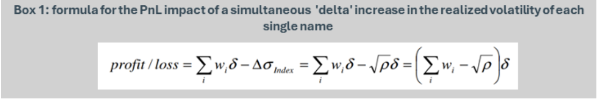
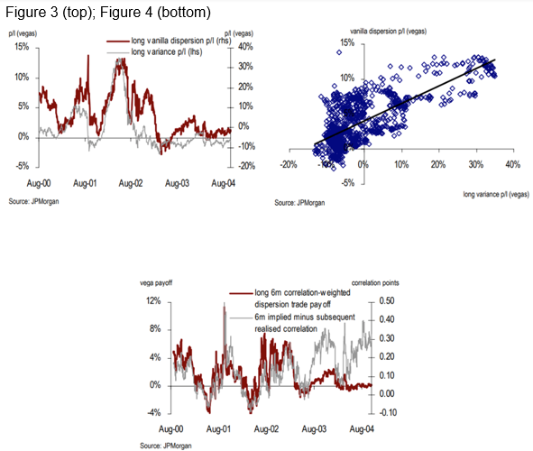

# Equity derivatives: long dispersion weighting schemes

> **Summary**

> • Depending on the relative weighting of single-stock and single-name legs, long dispersion PnL can be driven primarily by the gap between implied and realised correlation, or single-stock realised volatility

Long equity dispersion entails selling index volatility vs buying volatility on a basket of single names. The bet is that single-name volatility will realize high relative to index volatility. Intuitively, this outcome requires low realized correlation across constituents: individual stocks can experience large moves, but if these moves do not occur simultaneously—or offset one another—aggregate index volatility remains subdued. Thus, the trade is implicitly short realized single-name correlation. However, the richness of the index volatility being sold increases with implied correlation. For a given set of single-name implied volatilities, a higher level of market-priced correlation translates into higher index implied volatility. In conclusion, then, long dispersion is a bet that implied single-name correlation > realized single-name correlation, and is thus equivalent to harvesting 'correlation premia'. 
The exposures of a long-dispersion structure are determined by the relative vega notionals of the single-name and index legs (where vega notional is defined as the PnL impact of a 1 vol point increase in realized vol from the swap's vol strike). Consider the case in which each leg is sized at an equal vega notional, 'X'—'vanilla dispersion'. Were the realized volatility of each single name to increase by 1 vol point, the single-name leg of the trade would produce positive PnL equal to X (the sum of single-name vega notionals). The index leg, however, would realize negative PnL, on account of the attendant rise in index (realized) volatility. Yet, provided constituent correlations are imperfect (i.e., less than 1) index realized volatility will increase by less than 1 vol point, and so the index leg will lose less than X. With equal vega notionals, the structure therefore retains a net long exposure to single-name realized volatility.
This exposure can be neutralized by suitably compressing the ratio of single-name to index vega notionals. In fact, it can be shown that such neutrality requires the ratio of notionals to equal the square root of average pairwise constituent realized correlations—so-called 'correlation-weighted' dispersion (see Box 1).
(As an aside: because intra-index correlation is itself positively correlated with single-name realized volatility, as the latter increases, so does the pass-through to index realized volatility, and thus the structure will become progressively 'less long' single-name realized volatility as that very volatility increases. This may be mitigated by a sufficiently large ratio of single-name to index vega notionals).

Under equal vega notionals, the PnL of long dispersion is dominated by single-name realized volatility (Figure 3). Note, in Figure 3, that the PnL of a vanilla dispersion trade realizes negatively considerably less frequently than that of a long variance swap, owing to the subsidization of its carrying costs by the attendant long exposure to correlation premia (which in most cases realizes positively). Alternatively, should single-stock realized volatility exposure be hedged-away by deploying the correlation-weighted scheme (which, to be clear, will require constant re-hedging as correlation changes) then PnL is dominated by the difference between implied and subsequently realized correlation (Figure 4).
In essence: long dispersion = short correlation carry trade + long single-stock volatility trade. The former pays the theta on the latter; the latter serves as a hedge to the former.
Figure 3 (top); Figure 4 (bottom)

## When to do what?

Environments in which correlation premia is rich tend also to be environments in which single-stock realised vol is already elevated (think: immediate aftermath of a tail-event, where the market is pricing elevated levels of correlation). On the other hand, environments in which correlation premia is compressed, tend also to be environments in which single-stock realised volatility is cheap (low). Thus the optimal long dispersion weighting scheme is nicely split across regimes. In the first type of regime, you should seek pure exposure to the compression in correlation premia, rather than long exposure to something that is already rich (single-stock realised volatility) - hence correlation-weighted dispersion is optimal. In the second type of regime, you should seek pure exposure to expansion in single-stock realised volatility (which is presently cheap), rather than exposure to the compression of something that is already compressed (correlation premia) - hence, the equal-weighted scheme is optimal. 

## Conclusion 

The exposures borne by long-dispersion can differ markedly based on the relative weighting of single-stock vs index legs. 

**Ali Lodhi**
