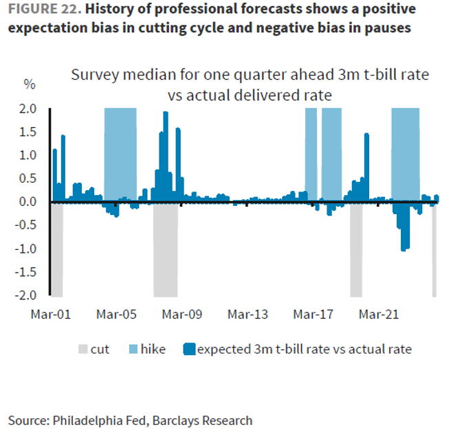
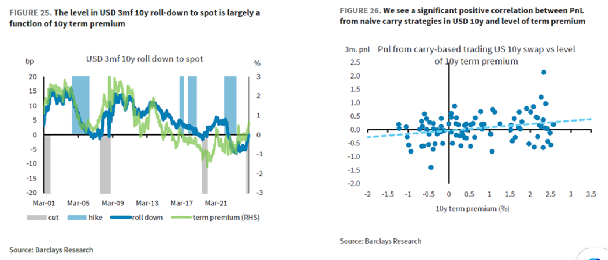

# Systematic strategies in interest rate swaps
 
Suppose the 1y1y rate is currently 3.5%, and the spot 1y rate (currently) 3%. Suppose I enter into an agreement to receive the 1y1y rate. Currently, my position is being valued with reference to the prevailing 1y1y part of the forward curve. As such, it is valued at par. However imagine that in a years time the forward curve is as it is currently (so that the spot 1y rate is still 3%). Now, my position is a spot-starting receive position in the 1y. However, anyone else who undertakes to enter into such a position shall be receiving 3% - whereas I am receiving 3.5% (in virtue of having had locked in the rate a year ago). Therefore I have experienced a mark-to-market appreciation in the value of my position, simply in virtue of the passage of time. This describes the concept of ‘roll-down/carry’ in interest rates (my position has 'rolled-down' the forward curve).
 
More generally: if the x-years forward rate on tenor y > spot-starting rate on tenor y, then conditional on the forward curve remaining fixed over the next x-years, my carry from receiving the x-years forward rate (starting now) will be positive. More specifically, what is needed is that the spot 1y rate, in a years time, realises below the 1y1y rate prevailing currently. So if I see that the 1y1y rate is currently 3.5%, and the 1y rate 3%, I need to have some certainty about the 1y rate in a years time being < 3.5% - otherwise, no positive carry (in fact, negative carry).
 
It so happens that the likelihood of this being the case depends crucially on the tenor of the underlying rate. Consider the 1y tenor. What happens here is that, in a hiking cycle, the 1y1y rate > 1y rate (naturally). However, investors tend to underestimate the level of the spot 1y rate in a years time, and therefore the eventual spot 1y rate tends to overshoot the current 1y1y rate. A similar story obtains in cutting cycles. See Figure below.

The profitability of this simple carry strategy, it turns out, is much improved in longer tenors. Consider the case that the 1y10y > spot 10y. In longer tenors, part of what this differential is likely to reflect is term premia. Imagine the term premia in the spot-starting 10y rate to presently be high (on the back of fiscal concerns, say). One should expect there to exist a positive term premia between the 1y10y and 10y points of the forward curve. Put it like this: 10y risk premia = the compensation for engaging with an uncertain object, now. 1y10y risk premia = the compensation for engaging with that same uncertain object, but now 1 year into the future. Hence uncertainty is being compounded, in the 1y10y case, and so 1y10y – 10y should embed a positive term premia.
 
In any case, if 1y10y > spot 10y, currently, what are the chances that in a year's time, current 1y10y > spot 10y? If part of that differential is embedding term premia, then one has to like their chances – at least better than the 1y case. This is because 1y1y = expectation of 1y rate in 1yrs time, but 1y10y = expectation of 10y in 1yrs time + term premium. Simply put: the 1y10y – 10y differential embeds more cushion than the equivalent for the 1y rate. Of course much more must be done to make this notion of ‘considerably more’, precise, etc.  
 
As Barclays’ Figure 25 demonstrates, it turns out that the 1y10y – 10 y differential is largely a function of the term premium. Performance of a simple carry strategy (that is, receiving the forward when forward > spot) is also positively correlated with term premium (we assume ACM is used here by Barclays), as shown in Barclays’ Figure 26.

  
More fully, we can fully express the 1y10y rate as = expectation of 10y in 1y + term premia + convexity premia. Just as a long position in the 10y rate is more positively convex than one in the 5y rate (that is, the asymmetry given by: PnL when rate goes down by 1%pts minus PnL when rate goes up by 1%, is greater, the longer the tenor – driven by the T(T+1) term in the second derivative of the price of a bond with respect to the market interest rate), so a long position in the 1y10y is more positively convex than one in the 10y. That should cause the 1y10y to be lower than it otherwise would be (the convexity premia is a negative number).  

All else equal, convexity premia should be higher (more negative) the higher is implied volatility (as positive convexity is worth more in such environments). Thus, in the event that 1y10y > 10y in a high implied volatility environment (an environment in which convexity premia will be high), then the cushion to receiving the 1y10y is being diminished (by the convexity premia). More precisely: ‘cushion’, when used above, is referring to the cushion against the expectations component of the forward rate being wrong to the extent that the eventual spot rate > current forward rate.

### Ali Lodhi
